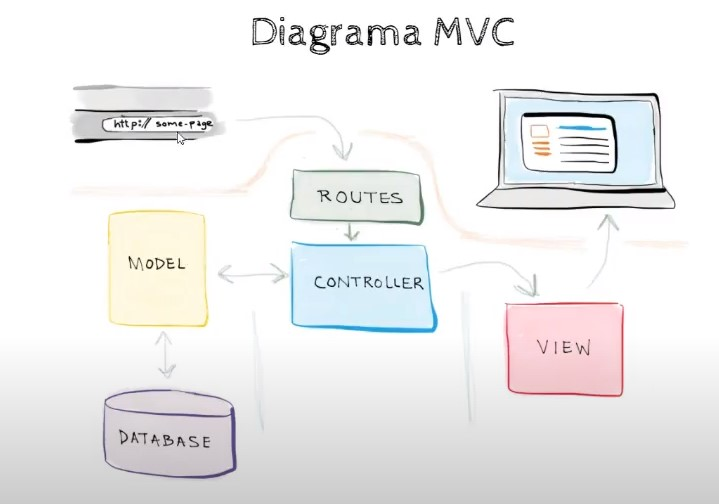

# **Clase 1  - Laravel**
## **Modelo Vista Controlador - MVC**
Especie de esquema para construir sistemas haciendo que cada componente haga una función en particular implementado en Laravel, evita el conocido código spaguetti.
### ***Separación***
 - Interfaz de Usuario > Vistas > HTML
 - Basde de datos > ORM > Modelos(Clases)
 - Lógica entre Vistas y Modelos > Controlador
### ***Diagrama***
- Rutas : Son directorios en los cuáles una cierta URL se ejecuta un método o controlador especificado para esa ruta
- Model : Comunicación hacia la base de datos
- Vista : Como lo va a ver el sistema}+

 
 #### **Documentación de Laravel**
__**https://laravel.com/docs/8.x**__

## Crear sistema de laravel 
Primero instalamos un instalador global de laravel 
~~~
composer global requiere laravel/installer
~~~

El codigo anterior nos permite crear nuevos proyectos con el codigo(se crea host virtual automaticamente)
~~~
laravel new example-app
~~~
Nos dirigimos a la carpeta creada en caso de que apache o ngnix no funcione y ejecutamos lo siguiente:
~~~
cd app

php artisan serve
~~~

### **Archivos creados**

### **composer.json**

Ahora si vemos se creo una carpeta con todos la estructura del proyecto, tenemos un archivo llamado ***composer.json*** que tiene la lista de paquetes que requiere el proyecto de laravel y tiene información de indexación para modificar.

~~~
"name": "laravel/laravel",
"type": "project",
"description": "The Laravel Framework.",
~~~

Paquetes requeridos en un entorno de desarrollo : 
~~~
"require-dev": {`
"facade/ignition": "^2.5",
"fakerphp/faker": "^1.9.1", - Nos ayuda a generar nombres de personas, correos y cosas random
"laravel/sail": "^1.0.1",
"mockery/mockery": "^1.4.2",`
"nunomaduro/collision": "^5.0",
"phpunit/phpunit": "^9.3.3"
},
~~~
### **composer.lock**

Ahora tenemos el archivo **composer.lock** que permite que en un entorno de desarrollo se trabaje con las versiones con las que se esten trabajando una vez estando en entorno de producción

### **vendor**

Los paquetes que se descargan estan en la carpeta de **/vendor**, esto no se incluye en los commits y no se tiene que modificar ninguno de los programas que se encuentran ahí

### **.env**

El archivo **.env** es un archivo independiente donde se encuentran las configuraciones y variables de entorno.
**Entorno de desarrollo** : 
~~~
APP_ENV=local
APP_KEY=base64:Yv2c4X+tn2BU0GoCEcJSbIN6GMYyE1BQVFmkzt+R+cU= - Encripta cookies 
APP_DEBUG=true
~~~
**Entorno de producción** : 
~~~
APP_ENV=production

APP_KEY=base64:Yv2c4X+tn2BU0GoCEcJSbIN6GMYyE1BQVFmkzt+R+cU=

APP_DEBUG=false
~~~
**Conexión de Bases de Datos**(sin contraseña para entorno de desarrollo) :
~~~
DB_CONNECTION=mysql
DB_HOST=127.0.0.1
DB_PORT=3306
DB_DATABASE=proyecto_d13
DB_USERNAME=root
DB_PASSWORD=
~~~
También podemos encontrar conexiones a servicios web.
Este archivo **.env** no se refleja en el commit, el **.env.example** si.

Para buscar archivos utilizar **CTL+P**
 
## Estructura de directorios

## **Carpeta publica**
Unica carpeta accesible para el navegador, aqui se ingresa CSS, imagenes y archivos accesibles desde navegador

## Vistas
Se encuentran en **/resources/views**

## Modelos
Se encuentra en **/app/models**
## Controladores
Se encuentra en **/http/controllers**

Interacción entre modelos y mandar datos a vistar.

## Rutas
Se encuentra en carpeta **/routes/web.php** y para comunicar aplicaciones **/routes/api.php**

Especie de directorio donde se recibe una URL y se llama a un controlador, modelo o algún elemento.

---
## Reinstalación de proyecto
Haber subido previamente a Github

1. Hacer `git clone ruta.git` en www de laravel.

Los archivos **.env** y la carpeta **/vendor** no aparecerán

2. Nos dirigimos a nuestra terminal y nos posicionamos en la carpeta donde se encuentra que se encuentra nuestro proyecto y ejecutamos.

    `composer install`

Esto instalará todas las dependencias y requerimientos del proyecto, y faltará el archivo **.env**

3. Desde terminal hacemos una copia del archivo **.env.example** 

    `cp .env.example .env`

Se creara archivo **.env** sin **APP-KEY** que se tendrá que generar

4. Para generarlo utilizaremos el codigo
   
    `php artisan key:generate`

Una vez generado ya podemos modificar los datos de entorno de **.env** para poder trabajar

Ya tenemos nuestra aplicación instalada :D
